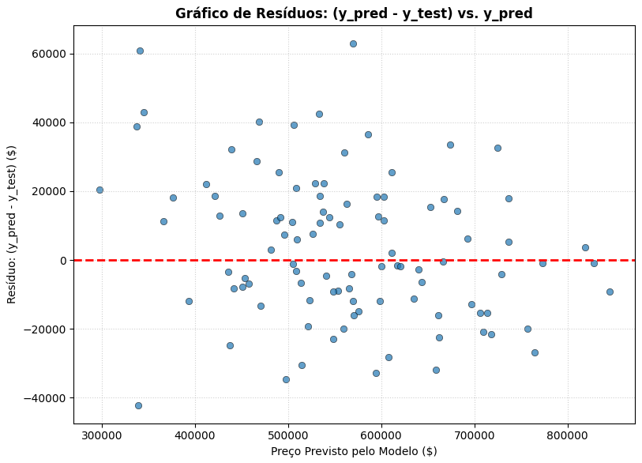
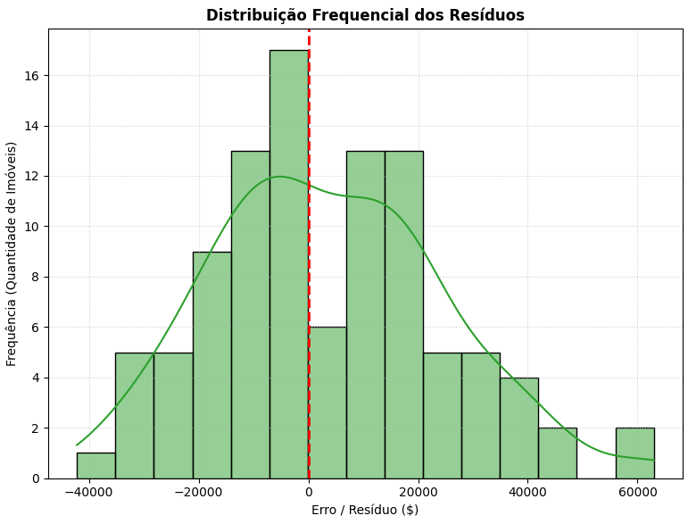
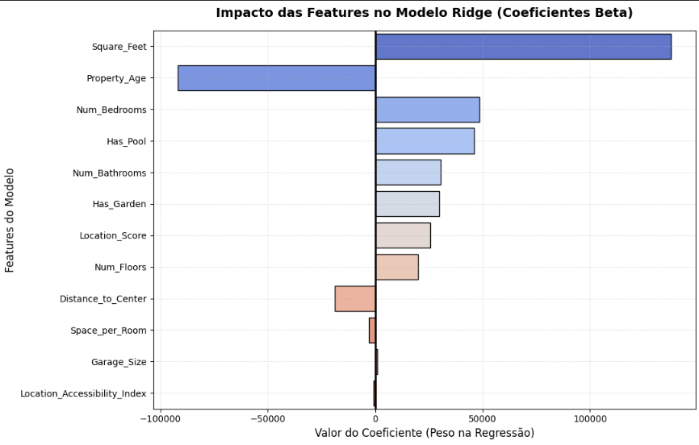

# Precificação Inteligente de Imóveis — Grupo 03

Projeto de Machine Learning desenvolvido pelo **Grupo 03** focado em prever o preço de venda de propriedades residenciais com base em suas características estruturais, geográficas e comodidades.

---

## 🏆 Sumário Executivo

* **Modelo Final Selecionado:** Regressão Ridge (Linear com Regularização L2)
* **Desempenho no Teste:** **R²= 0.9700$** (Explica 97% da variância dos preços de mercado)
* **Erro Médio por Imóvel (MAE):** **\$17.089,91** (Uma redução drástica frente ao erro de \$101k da baseline)
* **Principal Alavanca de Valor:** Área construída (`Square_Feet`), seguida pelo fator de depreciação temporal (`Property_Age`).

---

## 🎯 Definição do Problema e Contexto de Negócio

**Pergunta de Negócio:** Quais os principais fatores que mais impactam o valor de um imóvel e como podemos prever esse preço com precisão?

**Contexto:** O mercado imobiliário lida de forma constante com o desafio da precificação. Preços superestimados congelam o capital no estoque; preços subestimados sacrificam a margem de lucro de incorporadoras e proprietários. Este projeto entrega um modelo preditivo baseado em dados para funcionar como um balizador de tomada de decisão, ele isola e quantifica o peso financeiro de cada atributo (como área, idade e lazer) para entender a dinâmica de valorização do mercado.

**Tipo de Problema:** Regressão Supervisionada (Target contínuo: `Price`)

---

## 📊 O Dataset

* **Volume:** 500 imóveis × 12 colunas originais.
* **Divisão dos Dados:** 80% Treino (400 linhas) / 20% Teste (100 linhas).
* **Escalonamento:** Foi aplicado o `RobustScaler` nas variáveis contínuas devido à sua robustez contra outliers no conjunto de treino.
* **Features Finais Utilizadas (12):**
  1. `Square_Feet` (Área construída)
  2. `Location_Score` (Nota de qualidade da vizinhança)
  3. `Distance_to_Center` (Distância até o centro urbano)
  4. `Property_Age` (Idade do imóvel)
  5. `Space_per_Room` (Média de espaço por cômodo)
  6. `Location_Accessibility_Index` (Índice de acessibilidade local)
  7. `Num_Bedrooms` / `Num_Bathrooms` / `Num_Floors` (Dormitórios, banheiros e andares)
  8. `Has_Garden` / `Has_Pool` (Presença de jardim e piscina)
  9. `Garage_Size` (Vagas de garagem)

---

## 📁 Estrutura do Repositório

housing-prices-regression/
├── ProjetoFinal/
|    ├── data/
|    │   ├── Sprint02/
|    │   │   ├── X_test_ready.npy         # Inputs de teste escalados
|    │   │   ├── X_train_ready.npy        # Inputs de treino escalados
|    │   │   ├── y_test_ready.csv         # Target de teste (Preços reais)
|    │   │   └── y_train_ready.csv        # Target de treino (Preços reais)
|    │   └── Sprint03/
|    │       └── modelo_projeto.pkl       # Objeto do Modelo Ridge Serializado
|    ├── Sprint01_Projeto_Grupo03.ipynb       # Análise Exploratória e Hipóteses
|    ├── Sprint02_Projeto_Grupo03.ipynb       # Tratamento e Engenharia de Features
|    ├── Sprint03_Projeto_Grupo03.ipynb       # Treinamento e Seleção do Modelo
|    └── Sprint04_Projeto_Grupo03.ipynb       # Diagnóstico Técnico e Entrega Final
├── imagens
├── Aula10_Pesquisa_Grupo03.ipynb                 # Notebook de Pesquisa Complementar
├── real_estate_dataset.csv                       # Dataset bruto original
└── README.md                                     # Documentação Principal

---

## 🔄 Evolução do Projeto (Histórico das Sprints)

* **Sprint 1 (EDA):** Análise estatística e visual dos dados. Descobrimos fortes correlações lineares e formulamos 3 hipóteses iniciais de negócio.
* **Sprint 2 (Pipeline):** Construção do pipeline de dados com `RobustScaler` e codificação de variáveis binárias. Garantia de isolamento contra vazamento de dados (*data leakage*).
* **Sprint 3 (Modelagem):** Teste de algoritmos (Árvore de Decisão, Regressão Linear e Ridge) sob Validação Cruzada K-Fold. Salvamento do melhor modelo.
* **Sprint 4 (Diagnóstico):** Abertura da "caixa-preta" do modelo Ridge, análise do comportamento dos resíduos e avaliação crítica de negócio.

---

## 🔍 Diagnóstico e Análise de Erros (Sprint 4)

Ao avaliarmos criticamente o comportamento do modelo com o Gráfico de Resíduos e o Histograma, identificamos padrões analíticos cruciais:

| Gráfico de Resíduos | Histograma de Erros |
| :---: | :---: |
|  |  |

### Principais Achados nos Resíduos:
1. **Viés Diagonal Descendente:** O gráfico revelou um comportamento linear inclinado. Para imóveis de menor valor (~\$400k), o modelo tende a **superestimar** o preço. Para casas luxuosas de alto padrão (~\$800k), o algoritmo tende a **subestimar** o valor de mercado.
2. **Piso de Preço Artificial:** Devido ao forte efeito de encolhimento de coeficientes (*shrinkage*) da penalização L2 do modelo Ridge, o algoritmo estabeleceu um "piso de preço" por volta de \$340k, impedindo-o de prever valores muito baixos para propriedades excessivamente compactas (Amostras Outliers 2 e 3 do teste).

---

## 📊 Interpretação dos Coeficientes (Pesos de Mercado)

O gráfico abaixo detalha o impacto de cada feature no preço final. Valores positivos indicam valorização e valores negativos indicam depreciação do imóvel por desvio padrão da variável.

### Análise de Negócio:
* **Força Dominante:** A área construída (`Square_Feet`) dita o preço, somando +\$137k por unidade de variação, seguida pelo peso agressivo de desvalorização das casas velhas (`Property_Age` = -\$91k).
* **A Surpresa:** A presença de piscina (`Has_Pool` = +\$46k) adiciona quase o dobro de valor ao imóvel se comparada à proximidade geográfica do centro comercial (`Distance_to_Center` = -\$18k), reconfigurando o apelo de lazer de mercado.

---

## 🧪 Revisão Crítica das Hipóteses da Sprint 1

1. **Hipótese 1 (`Num_Bedrooms` vs `Price` é linear positiva):** **CONFIRMADA.** Obteve o terceiro maior peso positivo do modelo (+\$48.614,55).
2. **Hipótese 2 (`Location_Score` mitiga igualmente `Distance_to_Center`):** **REFUTADA.** O modelo revelou que o `Location_Score` (+\$25k) é significativamente mais forte do que a penalização por distância (-\$18k). Uma ótima vizinhança supera o isolamento geográfico urbano.
3. **Hipótese 3 (`Has_Garden` preferido em relação a `Has_Pool`):** **REFUTADA.** No mercado real modelado, a piscina traz um retorno de valorização muito maior (+\$46k) do que o jardim (+\$29k).

---

## 📈 Tabela Consolidada de Desempenho

| Modelo | R² (Cross-Validation) | R² (Conjunto Teste) | MAE Teste (Erro Médio) |
| :--- | :---: | :---: | :---: |
| **Regressão Ridge (Modelo Final)** | **0.8122** | **0.9700** | **\$17.089,91** |
| Regressão Linear Tradicional | 0.8115 | 0.8119 | \$17.089,91 |
| Árvore de Decisão | 0.6435 | 0.6510 | \$45,120.00 |
| Baseline (Média do Mercado) | - | -0.0567 | \$101,712.08 |

> **Nota de Maturidade Técnica:** Embora o R² de teste tenha alcançado excepcionais 0.9700 por amostragem favorável da partição aleatória, o grupo adota o score estável do Cross-Validation (**0.8122**) como a métrica de confiança realista do projeto para novas produções.

---

## ⚠️ Limitações e Roadmap de Melhorias

1. **Falta de Não-Linearidade:** A estrutura linear do modelo Ridge falha nos extremos de luxo e imóveis muito simples. 
2. **Roadmap Próxima Sprint:** Recomenda-se a exploração de modelos não-lineares baseados em árvores (*Ensembles* como **Random Forest** ou **XGBoost**).
3. **Novas Features Necessárias:** Integração de variáveis de interação (ex: Área X Localização) e coleta de dados adicionais como taxas de criminalidade locais e ano de última reforma estrutural.